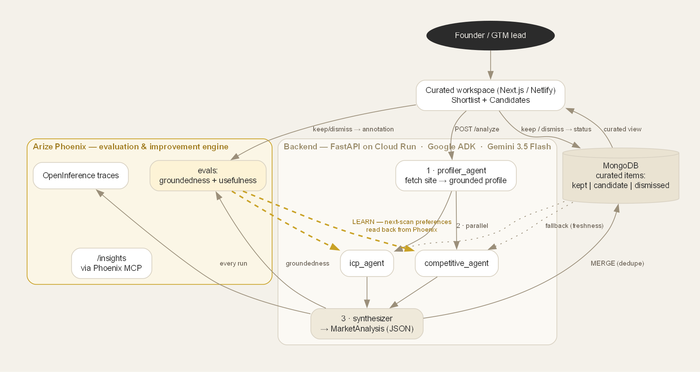
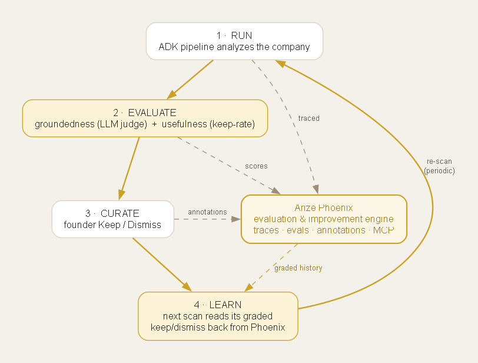

# Market Intelligence Agent

> A **living competitive-intelligence workspace** for B2B founders — it grounds its analysis, learns from your judgment, and **improves itself through Arize Phoenix**.

Built for the **Google Cloud Rapid Agent Hackathon** (Arize track) on **Gemini 3.5 Flash** + **Google ADK**, with **Arize Phoenix** as the evaluation & improvement engine.

**🔗 Live demo:** https://3ms-market-agent.netlify.app — login `demo` / `hackathon`
**📦 App, setup & full docs:** [`market-agent/`](market-agent/README.md)

---

## What it does

Give it a B2B company URL and it maps the competitive landscape and surfaces ICP-matched prospects in one pass — then it becomes a workspace that gets sharper every time you use it:

- **Grounded, not guessed** — a profiler agent reads the actual site first, so `ptg-usa.com` is correctly read as *Pension Technology Group* (pension software), not inferred from the domain.
- **Accumulate-and-curate** — re-scans *merge* into a persistent, deduped set. **Keep** pins to a shortlist, **Dismiss** hides, untouched items stay candidates. Nothing silently vanishes.
- **Learns your judgment** — your Keep/Dismiss shapes future scans, read back from Phoenix.
- **Trustworthy** — every analysis gets an LLM-as-judge groundedness score; the badge only warns when something's off.

## The self-improvement loop — Arize Phoenix as the engine

Phoenix is the agent's **evaluation & improvement engine** — it traces every run, scores it on **groundedness** (machine) and **usefulness** (human keep-rate), is the source the next scan **learns from** (Tier-2 reads keep/dismiss back from Phoenix), and is what the `/insights` agent **introspects via the Phoenix MCP server**. MongoDB is the fast product memory; Phoenix is where the agent's quality is measured and improved.

## Built with

**Gemini 3.5 Flash · Google ADK · Arize Phoenix** (tracing + evals + MCP) · FastAPI / Cloud Run · MongoDB Atlas · Next.js / Netlify

## Code & setup

The application lives in [**`market-agent/`**](market-agent/README.md) — architecture details, the Arize integration, API reference, and run/deploy instructions.

## License

[AGPL-3.0](LICENSE) — © 2026 Eliannah Linehan.
